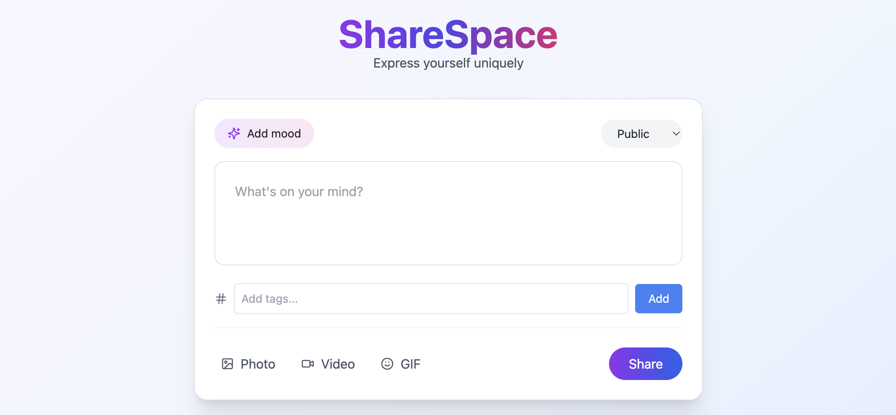

# ShareSpace


## 📁 Project Structure
    ```
    /sharespace
    ├── client
    ├── posts
    ├── comments 
    ├── query
    ├── event-bus
    ├── moderation

    #follow same steps for other folders too
    ```

## Getting Started

1. **Install dependencies** in each folder:
   ```
   cd client && npm install

   cd ../posts && npm install
   
   cd ../comments && npm install

   #follow same steps for other folders too
   ```

2. **Start services:**
    ```
    cd posts && npm start

    cd comments && npm start

    cd client && npm start

    #follow same steps for other folders too
    ```

---

## 🐳 Docker Containerization

Each service is containerized using Docker.

### 1. **Build Docker images**
From the root of each service folder:

    ```
    # For Post service
    cd posts
    docker build -t your-dockerhub-username/posts .

    # For Comment service
    cd ../comments
    docker build -t your-dockerhub-username/comments .

    # For Client (React frontend)
    cd ../client
    docker build -t your-dockerhub-username/client .

    #follow same steps for other folders too
    ```

### 1. **Run the containers**
Make sure ports inside the Dockerfiles are correctly exposed and match the service ports.

    ```
    # Run Post service
    docker run -p 4000:4000 your-dockerhub-username/posts

    # Run Comment service
    docker run -p 4001:4001 your-dockerhub-username/comments

    # Run Client (React)
    docker run -p 3000:3000 your-dockerhub-username/client

    #follow same steps for other folders too
    ```